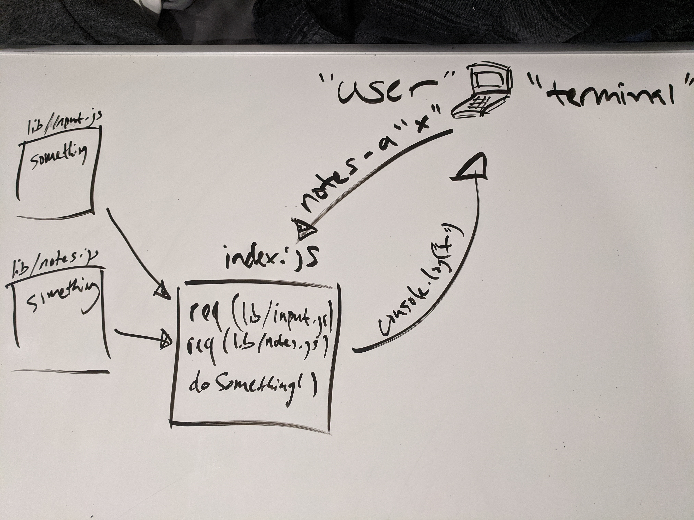

# NOTES APPLICATION

## Notes - class 04 lab

### Author: Clayton Jones

### Links and Resources

- [submission PR]()
- [ci/cd: GitHub Actions]()
- [NPM Package](https://www.npmjs.com/package/@claytonjones7/notes)

### Setup

#### `.env` requirements (where applicable)

N/A

#### How to initialize/run your application (where applicable)

- If cloned repo: `npm i`
- npm package: `npm i @claytonjones7/notes`
- connect to local mongoDB `mongod --dbpath=PATH_TO_DB`

#### How to use your library (where applicable)
- add a note: `notes -a (or --add) "NOTE_TO_ADD" (optional: --category "CATEGORY_FOR_NOTE")`
- list notes: `notes -l (or --list) (optional: "CATEGORY")`
- delete a note: `notes -d UNIQUE_NOTE_ID`

#### Tests

- How do you run tests?
  - `npm test`
- Any tests of note?
  - input module
    - testing various flags and user input combinations
  - notes module
    - no tests as of now
  - validator module
    - testing all validator methods with good/bad input
    - not necessary now, will end up deleting
- Describe any tests that you did not complete, skipped, etc
  - notes.test.js contains fake true is truthy test. not testing mongoDB functions at the moment

#### UML

