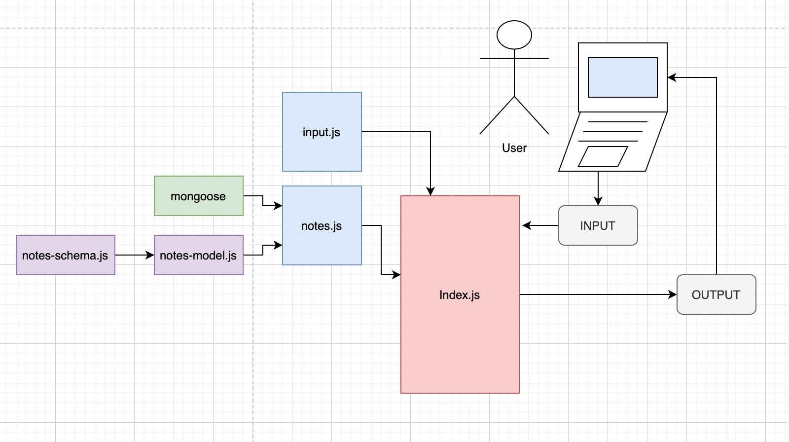

# Notes Application

## Notes - class 04 lab

### Author: Clayton Jones

### Links and Resources

- [submission PR](https://github.com/claytonjones-401n16/notes/pull/1)
- [ci/cd: GitHub Actions](https://github.com/claytonjones-401n16/notes/actions)
- [NPM Package](https://www.npmjs.com/package/@claytonjones7/notes)

### Setup

#### How to initialize/run your application (where applicable)

- If cloned repo: `npm i`
- npm package: `npm i @claytonjones7/notes`
- connect to local mongoDB `mongod --dbpath=PATH_TO_DB`

#### How to use your library (where applicable)
- add a note: `notes -a (or --add) "NOTE_TO_ADD" (optional: --category "CATEGORY_FOR_NOTE")`
- list notes: `notes -l (or --list) (optional: "CATEGORY")`
- delete a note: `notes -d UNIQUE_NOTE_ID`

#### Tests

- How do you run tests?
  - `npm test`
- Any tests of note?
  - input.js
    - testing various flags and user input combinations
  - notes.js
    - tests done in notes-model
  - notes-model.js
    - tested all CRUD functions
- Describe any tests that you did not complete, skipped, etc
  - notes.test.js contains fake true is truthy test. mongoDB CRUD functions tested in notes-model tests

#### UML

